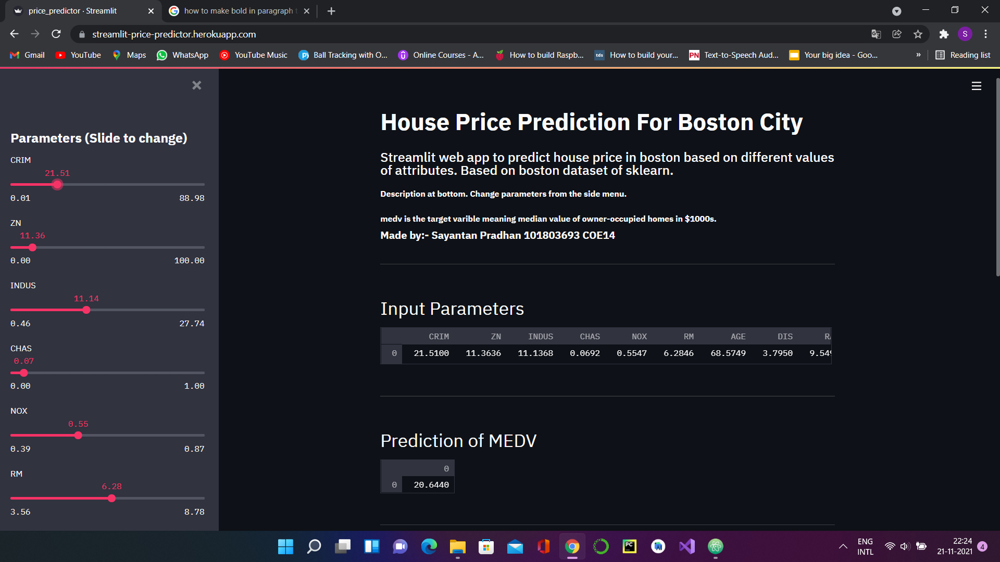
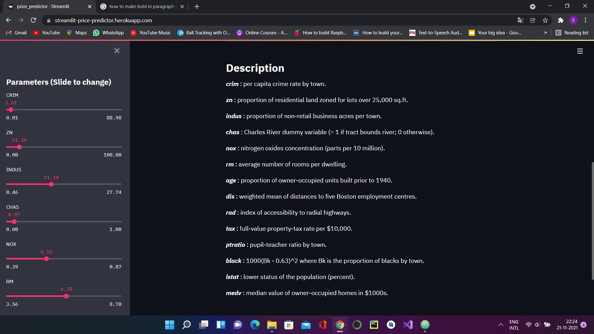
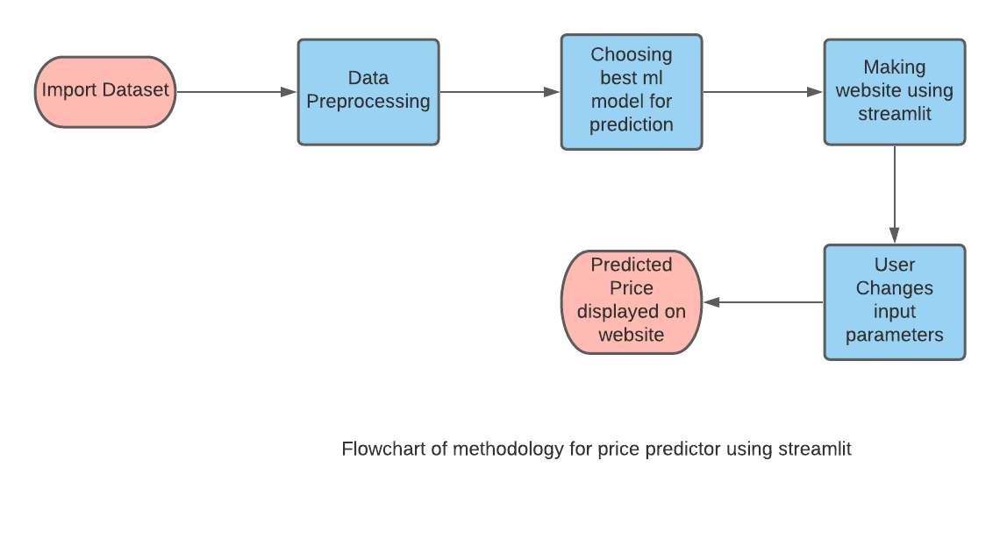

# Price Predictor Web App Using Streamlit

### Made By:- Sayantan Pradhan COE14 101803693

### Live Link:- https://streamlit-price-predictor.herokuapp.com/

### This project is a Price Predictor for houses in boston city. Its based on the Boston dataset of sklearn. The web app is made using streamlit.

  User can change the input parameters by changing the slidebars in the sidemenu. The corresponding predicted price will be shown accordingly.

 The input parameters are:-
  
  <b>crim</b> : per capita crime rate by town.
  
  <b>zn</b> : proportion of residential land zoned for lots over 25,000 sq.ft.

  <b>indus</b> : proportion of non-retail business acres per town.

  <b>chas</b> : Charles River dummy variable (= 1 if tract bounds river; 0 otherwise).

  <b>nox</b> : nitrogen oxides concentration (parts per 10 million).

  <b>rm</b> : average number of rooms per dwelling.

  <b>age</b> : proportion of owner-occupied units built prior to 1940.

  <b>dis</b> : weighted mean of distances to five Boston employment centres.

  <b>rad</b> : index of accessibility to radial highways.

  <b>tax</b> : full-value property-tax rate per \$10,000.

  <b>ptratio</b> : pupil-teacher ratio by town.

  <b>black</b> : 1000(Bk - 0.63)^2 where Bk is the proportion of blacks by town.

  <b>lstat</b> : lower status of the population (percent).

  <b>medv</b> : median value of owner-occupied homes in \$1000s.

  
## Screenshots of working project

<table style="width:100%">
  <tr>
    <th></th>
    <th></th>
  </tr>
  <tr>
    <th></th>
  </tr>
  </table>
  
 ## Flowchart of methodology
 

